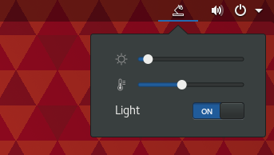

# Elgato Key Light (Air) Gnome Shell Extension

Gnome Extension for quick access to Elgato Key Light (Air).
* Brightness
* Temperature
* Turn on/off

## Installing
Create a config file in `~/.config/elgato-key-light/config.json` containing the host and port for your elgato light inside a `url` key. Something like this

`{"url": "http://192.168.1.104:9123"}`

You can find the ip and port by issuing e.g.

`avahi-browse -atrp | grep _elg._tcp` 

## Author
Samuel Carlsson
